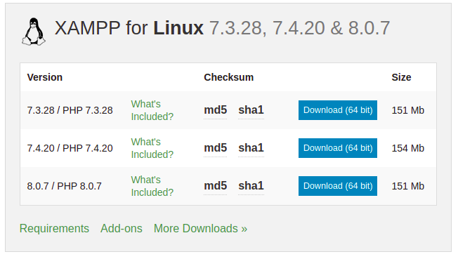

# Instalacion y configuracion de XAMPP

* Descargar instalador para linux [apachefriends](https://www.apachefriends.org/download.html)

<p align="center">
  
</p> 


//OR, AS THE CASE MAY BE 

* Arrancar xampp
```shell
$ sudo /opt/lampp/lampp start
```
* Detener xampp
```shell
$ sudo /opt/lampp/lampp stop
```
